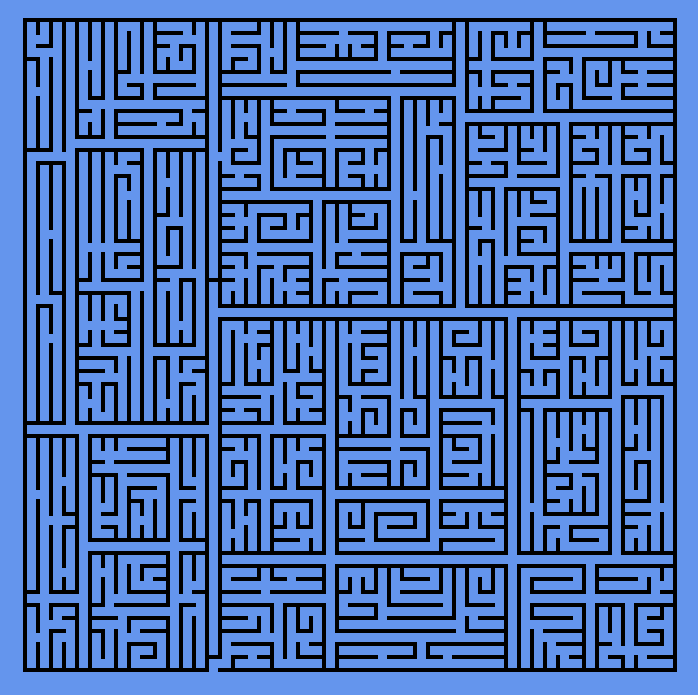
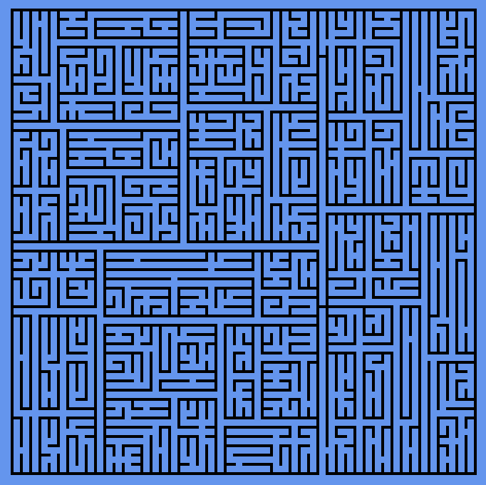

At the moment, this is just a utility to generate random (solvable) mazes. 

I wrote the algorithm myself, and as can be seen below, the current mazes it generates are slightly easy. However, I have some ideas to make the mazes more complicated to solve. This will be implemented at a later stage.

     

