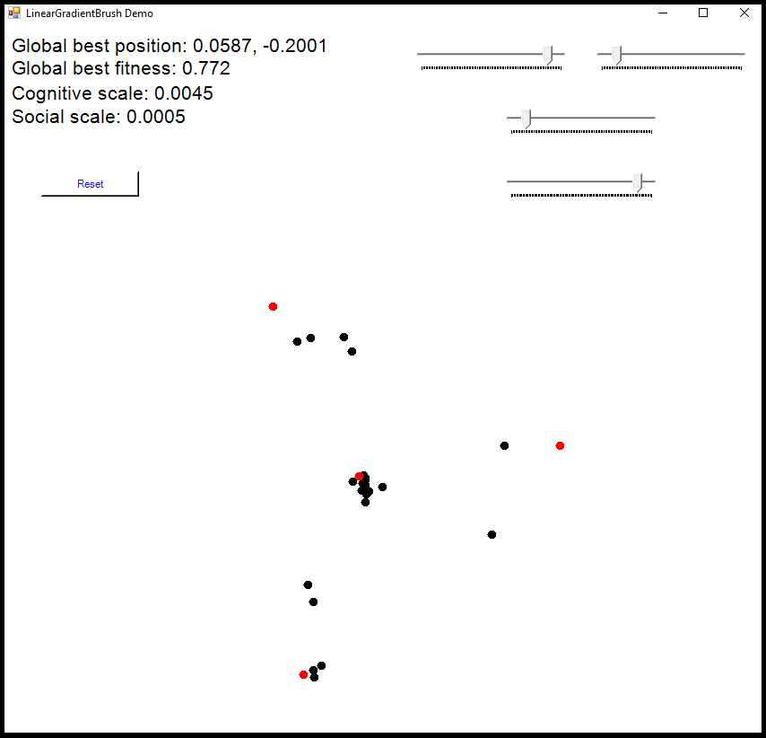

#PSO 2D Visualization

A visualization tool for 2 dimensional Particle swarm optimization (PSO). Currently, the user can specify his/her own objective function (in the code), and also specify points where the solution is optimal. These points can be added or removed in the interface (a screenshot of this is shown below) by right clicking. Existing optimal points can also be dragged around the optimisation landscape.

   ## TODO
+ Make labels for sliders
