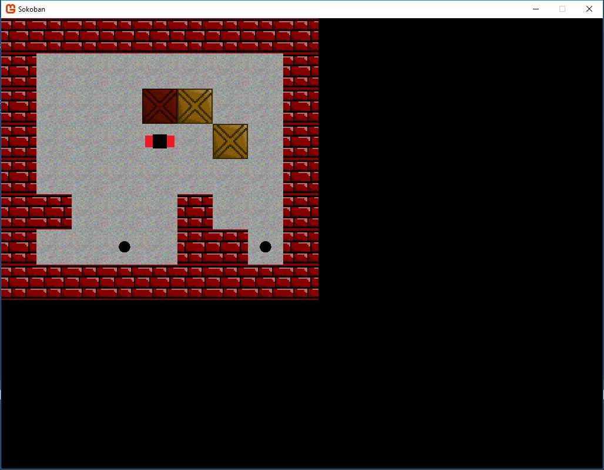
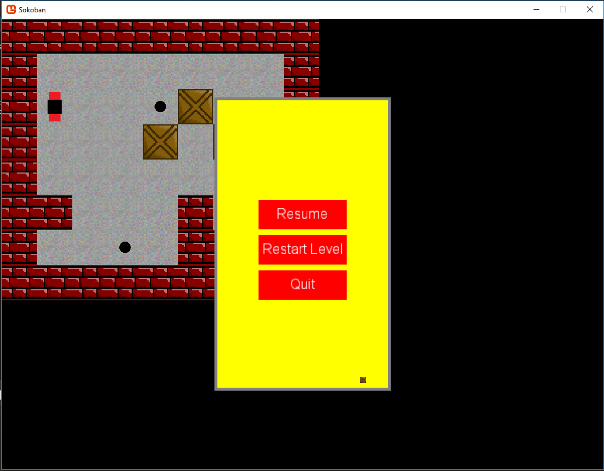
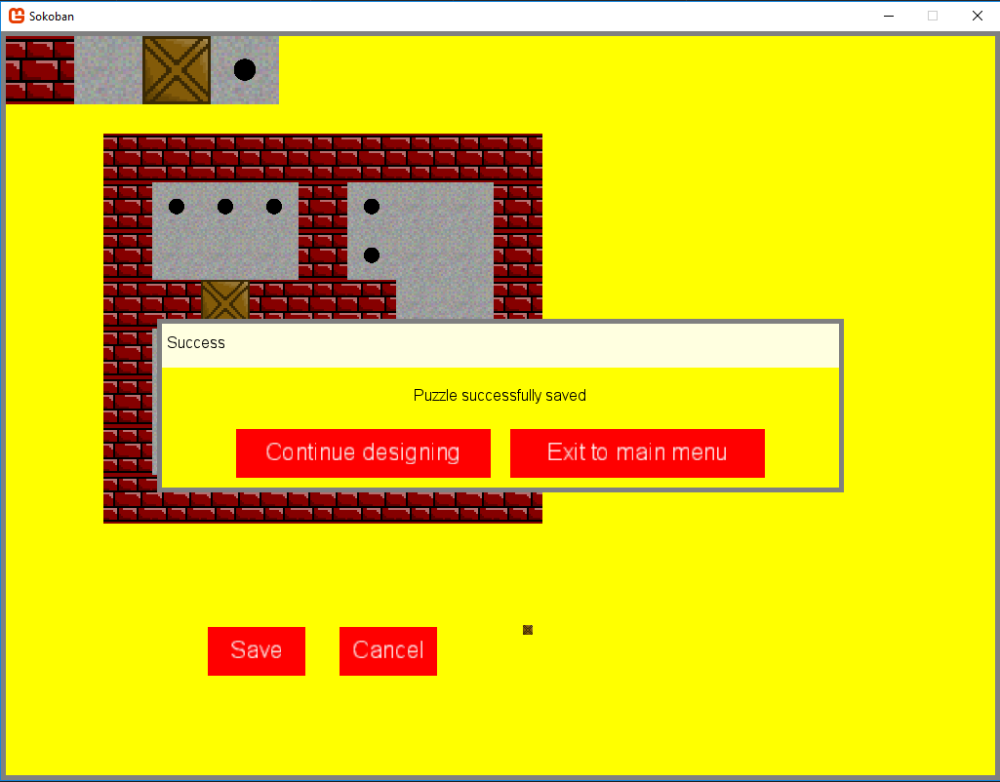

#Sokoban

A Sokoban clone. The user must push all boxes onto the dots. This version that I wrote can take customized maps (puzzles) to play on. At the moment text files are used as input for the puzzle (see Sokoban/test1.txt for a sample), but I plan to write a small add-on that will essentially be a puzzle editor in a GUI. This will make it very easy to design new puzzles.

##TODO

+ Create main menu

+ Finish puzzle editor. Add functionality for:
 - adding the starting point
 - specifying the grid size
